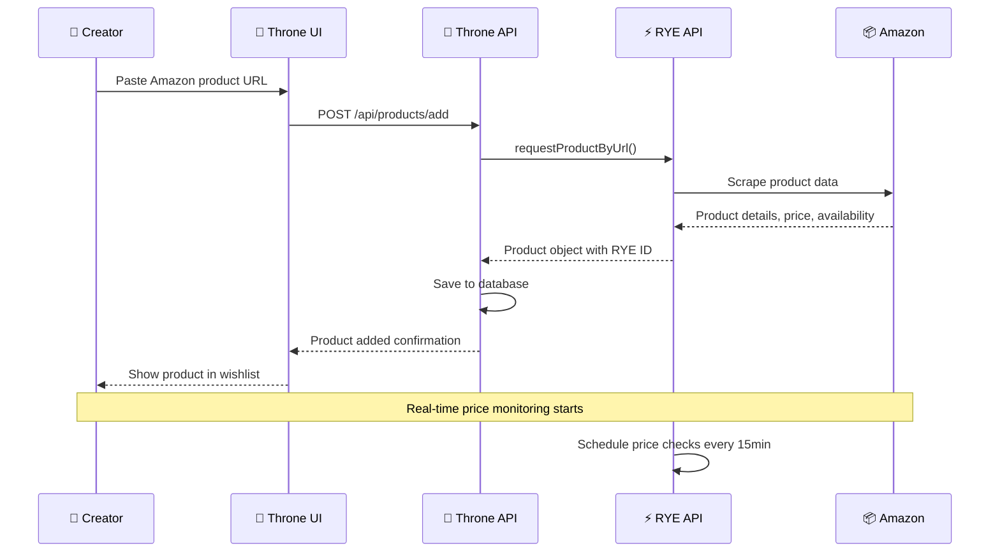
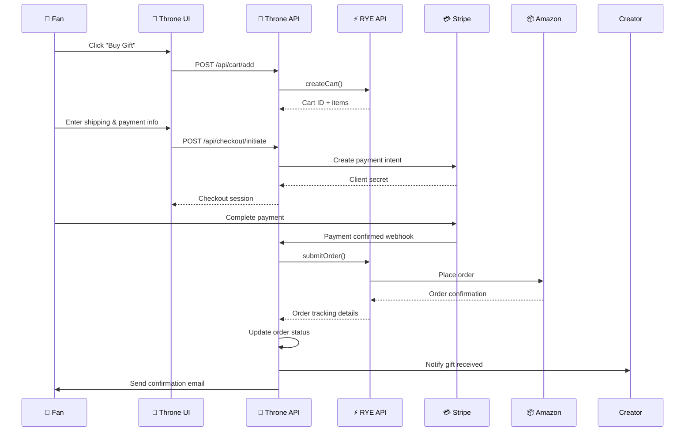
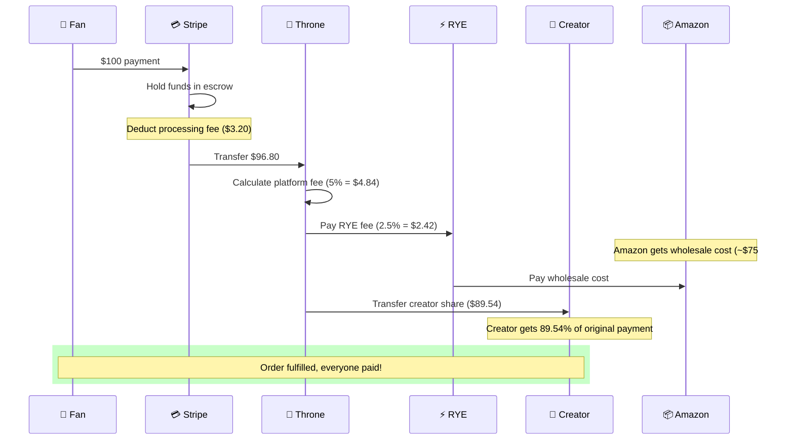
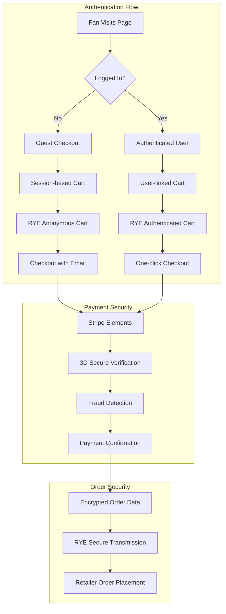

# Throne.com RYE Technical Implementation Flows

## 🔧 API Integration Sequence Diagrams

### **1. Product Addition Flow (Creator Side)**



### **2. Purchase Flow (Fan Side)**



### **3. Revenue Distribution Flow**



---

## 🏗️ Database Schema & Relationships

### **Core Tables Structure**

```sql
-- Throne Platform Tables
CREATE TABLE creators (
    id BIGINT PRIMARY KEY,
    uuid VARCHAR(36) UNIQUE,
    username VARCHAR(50) UNIQUE,
    email VARCHAR(255),
    stripe_account_id VARCHAR(255),
    payout_schedule ENUM('weekly', 'monthly'),
    status ENUM('active', 'suspended'),
    created_at TIMESTAMP
);

CREATE TABLE products (
    id BIGINT PRIMARY KEY,
    uuid VARCHAR(36) UNIQUE,
    creator_id BIGINT,
    rye_product_id VARCHAR(255), -- RYE's product ID
    product_url TEXT,
    title VARCHAR(500),
    description TEXT,
    price_cents INT,
    currency VARCHAR(3) DEFAULT 'USD',
    images JSON,
    status ENUM('active', 'inactive', 'out_of_stock'),
    priority INT DEFAULT 0,
    created_at TIMESTAMP,
    FOREIGN KEY (creator_id) REFERENCES creators(id)
);

CREATE TABLE orders (
    id BIGINT PRIMARY KEY,
    uuid VARCHAR(36) UNIQUE,
    creator_id BIGINT,
    fan_email VARCHAR(255),
    rye_cart_id VARCHAR(255),
    rye_order_id VARCHAR(255),
    stripe_payment_intent_id VARCHAR(255),
    total_amount_cents INT,
    platform_fee_cents INT,
    rye_fee_cents INT,
    creator_payout_cents INT,
    status ENUM('pending', 'processing', 'shipped', 'delivered', 'cancelled'),
    shipping_address JSON,
    gift_message TEXT,
    is_anonymous BOOLEAN DEFAULT FALSE,
    created_at TIMESTAMP,
    FOREIGN KEY (creator_id) REFERENCES creators(id)
);

CREATE TABLE order_items (
    id BIGINT PRIMARY KEY,
    order_id BIGINT,
    product_id BIGINT,
    quantity INT,
    unit_price_cents INT,
    total_price_cents INT,
    rye_line_item_id VARCHAR(255),
    FOREIGN KEY (order_id) REFERENCES orders(id),
    FOREIGN KEY (product_id) REFERENCES products(id)
);

-- RYE Integration Tables
CREATE TABLE rye_carts (
    id BIGINT PRIMARY KEY,
    uuid VARCHAR(36) UNIQUE,
    creator_id BIGINT,
    fan_session VARCHAR(255),
    rye_cart_id VARCHAR(255) UNIQUE,
    cart_data JSON,
    expires_at TIMESTAMP,
    created_at TIMESTAMP,
    FOREIGN KEY (creator_id) REFERENCES creators(id)
);

CREATE TABLE rye_webhooks (
    id BIGINT PRIMARY KEY,
    event_type VARCHAR(100),
    rye_order_id VARCHAR(255),
    payload JSON,
    processed BOOLEAN DEFAULT FALSE,
    created_at TIMESTAMP
);
```

---

## 🔄 API Endpoint Architecture

### **Throne Platform Endpoints**

```javascript
// Product Management
POST   /api/creators/{id}/products          // Add product from URL
GET    /api/creators/{id}/products          // Get creator's products
PATCH  /api/products/{uuid}                 // Update product
DELETE /api/products/{uuid}                 // Remove product

// Shopping & Cart
GET    /api/{username}/wishlist             // Public wishlist view
POST   /api/cart/add                        // Add item to cart
GET    /api/cart/{session_id}               // Get cart contents
POST   /api/checkout/initiate               // Start checkout process
POST   /api/checkout/complete               // Complete purchase

// Order Management
GET    /api/creators/{id}/orders            // Creator's received orders
GET    /api/orders/{uuid}                   // Order details
POST   /api/orders/{uuid}/thank             // Send thank you message

// Analytics & Reporting
GET    /api/creators/{id}/analytics         // Creator dashboard data
GET    /api/platform/metrics               // Platform-wide metrics
```

### **RYE API Integration Points**

```javascript
// Product Operations
rye.requestProductByUrl({
  input: {
    url: "https://amazon.com/dp/B07FZ8S74R",
    marketplace: "AMAZON"
  }
})

rye.getProductById({
  input: { productId: "rye_product_123" }
})

// Cart Operations  
rye.createCart({
  input: {
    items: {
      amazonCartItemsInput: [{
        quantity: 1,
        productId: "rye_product_123"
      }]
    },
    buyerIdentity: {
      firstName: "John",
      lastName: "Doe", 
      email: "john@example.com",
      // ... address details
    }
  }
})

// Order Processing
rye.submitOrder({
  id: "cart_123",
  paymentMethodId: "stripe_pm_123"
})

rye.getOrder({
  id: "order_123"
})
```

---

## 🔐 Security & Authentication Flow

### **Multi-Party Authentication**



---

## 📊 Real-time Data Synchronization

### **Price & Inventory Monitoring**

```javascript
// Price Monitoring System
class PriceMonitor {
  constructor() {
    this.priceCheckInterval = 15 * 60 * 1000; // 15 minutes
    this.products = new Map();
  }

  async startMonitoring(productId) {
    setInterval(async () => {
      try {
        const currentData = await rye.getProductById({
          input: { productId }
        });
        
        const storedProduct = await db.products.findByRyeId(productId);
        
        if (currentData.price.value !== storedProduct.price_cents) {
          await this.handlePriceChange(productId, currentData);
        }
        
        if (currentData.availability !== storedProduct.availability) {
          await this.handleAvailabilityChange(productId, currentData);
        }
      } catch (error) {
        console.error(`Price check failed for ${productId}:`, error);
      }
    }, this.priceCheckInterval);
  }

  async handlePriceChange(productId, newData) {
    // Update database
    await db.products.update(productId, {
      price_cents: newData.price.value,
      updated_at: new Date()
    });
    
    // Notify creator
    await notifications.send({
      type: 'price_change',
      productId,
      oldPrice: storedProduct.price_cents,
      newPrice: newData.price.value
    });
    
    // Update active carts with price changes
    await this.updateActiveCartsPrice(productId, newData.price.value);
  }
}
```

### **Webhook Processing System**

```javascript
// Webhook Handler for Order Updates
class WebhookProcessor {
  async handleRyeWebhook(payload) {
    const { eventType, orderId, data } = payload;
    
    switch (eventType) {
      case 'order.confirmed':
        await this.handleOrderConfirmed(orderId, data);
        break;
        
      case 'order.shipped':
        await this.handleOrderShipped(orderId, data);
        break;
        
      case 'order.delivered':
        await this.handleOrderDelivered(orderId, data);
        break;
        
      case 'order.cancelled':
        await this.handleOrderCancelled(orderId, data);
        break;
    }
  }

  async handleOrderShipped(orderId, data) {
    // Update order status
    await db.orders.updateByRyeId(orderId, {
      status: 'shipped',
      tracking_number: data.trackingNumber,
      carrier: data.carrier,
      estimated_delivery: data.estimatedDelivery
    });
    
    // Notify creator and fan
    const order = await db.orders.findByRyeId(orderId);
    await notifications.sendMultiple([
      {
        type: 'order_shipped',
        recipient: order.creator_email,
        data: { orderId, trackingNumber: data.trackingNumber }
      },
      {
        type: 'gift_shipped', 
        recipient: order.fan_email,
        data: { orderId, trackingNumber: data.trackingNumber }
      }
    ]);
  }
}
```

---

## 🚀 Performance Optimization Strategies

### **Caching Layer Architecture**

```javascript
// Multi-level Caching System
class CacheManager {
  constructor() {
    this.redis = new Redis(process.env.REDIS_URL);
    this.memcache = new Map(); // In-memory cache
  }

  async getProduct(productId) {
    // Level 1: Memory cache (fastest)
    if (this.memcache.has(`product:${productId}`)) {
      return this.memcache.get(`product:${productId}`);
    }
    
    // Level 2: Redis cache (fast)
    const cached = await this.redis.get(`product:${productId}`);
    if (cached) {
      const product = JSON.parse(cached);
      this.memcache.set(`product:${productId}`, product);
      return product;
    }
    
    // Level 3: Database (slower)
    const product = await db.products.findById(productId);
    
    // Level 4: RYE API (slowest, only if needed)
    if (!product.last_synced || this.isStale(product.last_synced)) {
      const ryeData = await rye.getProductById({ 
        input: { productId: product.rye_product_id } 
      });
      product = await this.syncProduct(product, ryeData);
    }
    
    // Cache at all levels
    await this.redis.setex(`product:${productId}`, 300, JSON.stringify(product));
    this.memcache.set(`product:${productId}`, product);
    
    return product;
  }
}
```

### **Database Optimization**

```sql
-- Strategic Indexes for Performance
CREATE INDEX idx_products_creator_status ON products(creator_id, status);
CREATE INDEX idx_products_rye_id ON products(rye_product_id);
CREATE INDEX idx_orders_creator_status ON orders(creator_id, status);
CREATE INDEX idx_orders_rye_order_id ON orders(rye_order_id);

-- Partitioning for Large Tables
CREATE TABLE orders_2024 PARTITION OF orders 
FOR VALUES FROM ('2024-01-01') TO ('2025-01-01');

CREATE TABLE orders_2025 PARTITION OF orders 
FOR VALUES FROM ('2025-01-01') TO ('2026-01-01');
```

---

## 📱 Frontend Integration Patterns

### **React Component Architecture**

```jsx
// WishlistProduct Component
import { useRyeProduct, useCart } from '@/hooks/rye';

function WishlistProduct({ productId, creatorId }) {
  const { product, loading, error } = useRyeProduct(productId);
  const { addToCart, cartLoading } = useCart();

  const handleAddToCart = async () => {
    try {
      await addToCart({
        productId: product.ryeId,
        creatorId,
        quantity: 1
      });
      
      // Track analytics
      analytics.track('Product Added to Cart', {
        productId,
        creatorId,
        price: product.price.value
      });
      
    } catch (error) {
      toast.error('Failed to add to cart');
    }
  };

  if (loading) return <ProductSkeleton />;
  if (error) return <ProductError error={error} />;

  return (
    <div className="wishlist-product">
      <ProductImage src={product.images[0]?.url} alt={product.title} />
      <ProductTitle>{product.title}</ProductTitle>
      <ProductPrice 
        amount={product.price.value} 
        currency={product.price.currency} 
      />
      <ProductAvailability status={product.availability} />
      
      <BuyButton 
        onClick={handleAddToCart}
        loading={cartLoading}
        disabled={product.availability !== 'available'}
      >
        Buy as Gift
      </BuyButton>
    </div>
  );
}
```

### **Custom Hooks for RYE Integration**

```javascript
// useRyeProduct Hook
import { useQuery } from '@tanstack/react-query';

export function useRyeProduct(productId) {
  return useQuery({
    queryKey: ['rye-product', productId],
    queryFn: () => api.get(`/api/products/${productId}`),
    staleTime: 5 * 60 * 1000, // 5 minutes
    refetchInterval: 15 * 60 * 1000, // 15 minutes (price updates)
  });
}

// useCart Hook
export function useCart() {
  const [cart, setCart] = useState(null);
  const [loading, setLoading] = useState(false);

  const addToCart = async (item) => {
    setLoading(true);
    try {
      const response = await api.post('/api/cart/add', item);
      setCart(response.data.cart);
      
      // Update cart counter in header
      document.dispatchEvent(new CustomEvent('cartUpdated', {
        detail: { count: response.data.cart.itemCount }
      }));
      
    } finally {
      setLoading(false);
    }
  };

  return { cart, addToCart, loading };
}
```

This technical documentation provides the complete implementation details for building a Throne.com-like platform with RYE integration. The key is to maintain real-time synchronization between all parties while providing a seamless user experience for both creators and fans.

<citations>
<document>
<document_type>WEB_PAGE</document_type>
<document_id>https://throne.com</document_id>
</document>
</citations>
