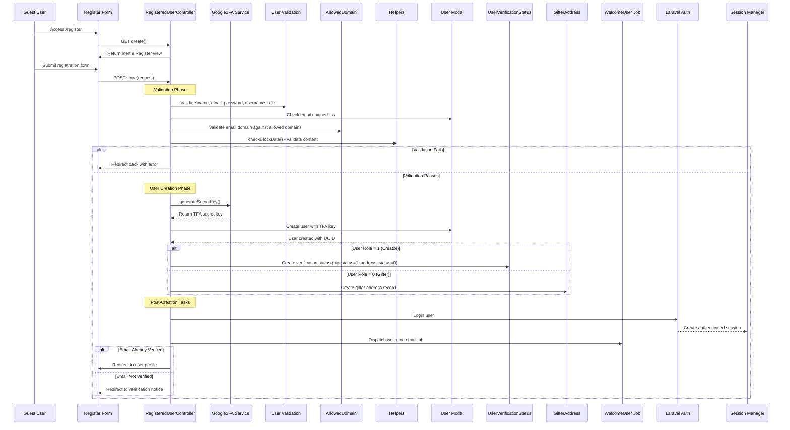
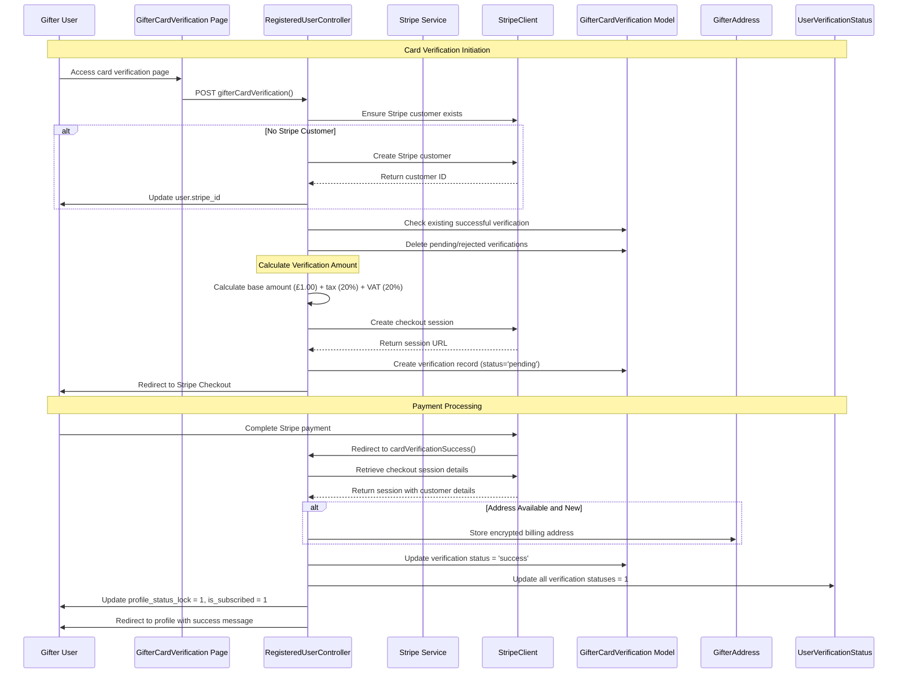
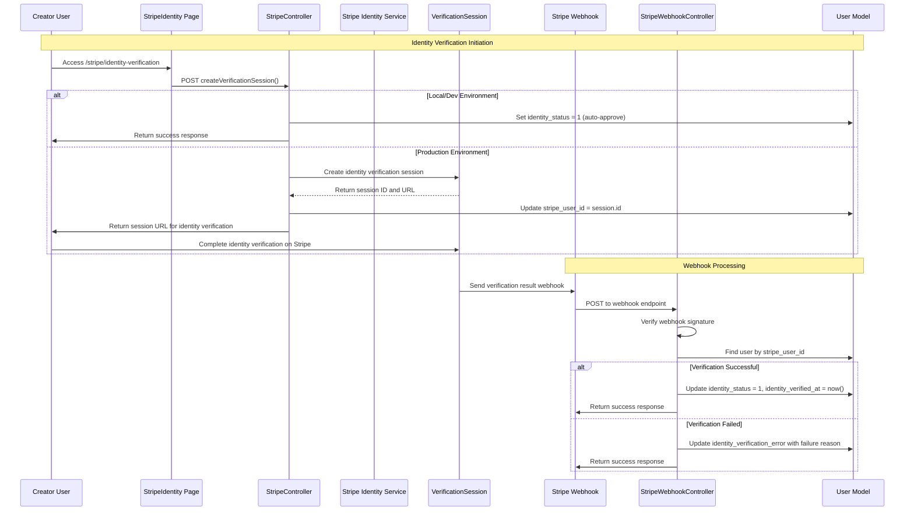
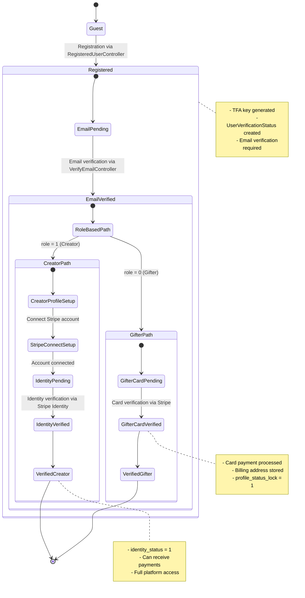

# SpennyPiggy Authentication & User Verification Workflows

## Overview
This document contains sequence diagrams tracking the complete user journey from guest registration to fully verified creator status, including all authentication and verification components.

## State Transitions Overview
- **Guest** → **Registered** (via RegisteredUserController)
- **Registered** → **Email Verified** (via email verification)
- **Email Verified** → **Card Verified** (for gifters via Stripe card verification)
- **Email Verified** → **Identity Verified** (for creators via Stripe Identity)
- **Identity Verified** → **Creator** (full verification complete)

---

## 1. Guest → Registered User Flow



---

## 2. Email Verification Flow

```mermaid
sequenceDiagram
    participant U as User
    participant VN as Verification Notice
    parameter EVN as EmailVerificationNotificationController
    participant WU as WelcomeUser Job
    participant Mail as Mail Service
    parameter VE as VerifyEmailController
    parameter UM as User Model
    parameter Auth as Authentication

    U->>VN: Access /verification
    VN->>U: Show "Verify your email" page
    
    U->>EVN: Click "Resend verification"
    EVN->>Mail: Send verification email
    Mail-->>U: Email with verification link
    
    U->>Mail: Click verification link in email
    Mail->>VE: GET /user/{uuid}
    
    VE->>UM: Find user by UUID
    alt User Found
        VE->>UM: Update email_verified_at = now()
        UM-->>VE: Email verification saved
        VE->>U: Redirect to user profile with success
    else User Not Found
        VE->>U: Redirect to login with error
    end
```

---

## 3. Two-Factor Authentication (2FA) Setup & Login Flow

```mermaid
sequenceDiagram
    participant U as User
    participant L as Login Form
    participant ASC as AuthenticatedSessionController
    participant G2FA as Google2FA Service
    participant UBC as UserBackupCode
    parameter Recovery as Recovery Service
    participant Auth as Laravel Auth
    participant TFA as TFA Page

    Note over U,TFA: 2FA Setup Flow
    U->>ASC: GET show2faQR()
    ASC->>G2FA: Generate QR code for user's TFA key
    G2FA-->>ASC: Return QR code data
    ASC->>U: Display QR code for authenticator app

    U->>ASC: POST update2faStatus() - Enable 2FA
    ASC->>U: Update user.is_2fa = true

    U->>ASC: GET generateBackupCode()
    ASC->>Recovery: Generate 5 backup codes
    Recovery-->>ASC: Return backup codes
    ASC->>UBC: Store encrypted backup codes
    ASC->>U: Display backup codes

    Note over U,TFA: 2FA Login Flow
    U->>L: Enter email/password
    L->>ASC: POST verifyUser()
    ASC->>ASC: Check if user has 2FA enabled
    
    alt 2FA Enabled
        ASC->>TFA: Redirect to TFA verification
        TFA->>U: Show OTP/Backup code input
        
        U->>ASC: POST verify2FA() with OTP/backup code
        
        alt Using OTP
            ASC->>G2FA: verifyKey(user.tfa_key, otp)
            G2FA-->>ASC: Return validation result
        else Using Backup Code
            ASC->>UBC: Check and consume backup code
            UBC-->>ASC: Return validation result
        end
        
        alt Verification Success
            ASC->>Auth: Authenticate user
            Auth-->>ASC: Session created
            ASC->>U: Redirect to user profile
        else Verification Failed
            ASC->>TFA: Show error message
        end
    else 2FA Disabled
        ASC->>Auth: Standard authentication
        ASC->>U: Redirect to user profile
    end
```

---

## 4. Gifter Card Verification Flow



---

## 5. Creator Identity Verification Flow (Stripe Identity)



---

## 6. Session Handling & Middleware Protection Flow

```mermaid
sequenceDiagram
    participant U as User
    participant R as Request
    participant HIR as HandleInertiaRequests
    participant UEMV as UserEmailVerify Middleware
    parameter CGCV as CheckGifterCardVerification
    participant CSIV as CheckStripeIdentityVerification
    participant Auth as Authentication
    participant Session as Session Manager

    Note over U,Session: Request Processing
    U->>R: Make authenticated request
    R->>HIR: Process Inertia request
    
    HIR->>Session: Get flash messages (success, error, warning, info)
    HIR->>Auth: Get current user
    HIR->>HIR: Load verification status, notifications, cart count
    HIR-->>R: Add shared props to response

    Note over R,Session: Middleware Chain
    R->>UEMV: Check email verification
    alt Email Not Verified
        UEMV->>R: Redirect to verification notice
    else Email Verified
        UEMV->>CGCV: Continue to next middleware
    end
    
    CGCV->>CGCV: Check if gifter needs card verification
    alt Gifter & Limit Exceeded & Not Card Verified
        CGCV->>R: Return GifterCardVerification page
    else Card Verified or Not Required
        CGCV->>CSIV: Continue to next middleware
    end
    
    CSIV->>CSIV: Check if creator needs identity verification
    alt Creator & Profile Locked & Not Identity Verified & Has Paid Subscription
        CSIV->>R: Return StripeIdentity page
    else Identity Verified or Not Required
        CSIV->>R: Allow request to continue
    end
```

---

## 7. Complete User State Transition Overview



---

## Key Components Summary

### Controllers
- **RegisteredUserController**: Handles registration, card verification for gifters
- **AuthenticatedSessionController**: Manages login, 2FA, session handling
- **StripeController**: Manages Stripe Connect, identity verification
- **VerifyEmailController**: Handles email verification

### Models
- **User**: Core user model with verification status fields
- **UserVerificationStatus**: Tracks verification progress by role
- **GifterCardVerification**: Stores card verification attempts
- **UserBackupCode**: Stores encrypted 2FA backup codes

### Middleware
- **UserEmailVerify**: Ensures email is verified
- **CheckGifterCardVerification**: Enforces card verification for gifters
- **CheckStripeIdentityVerification**: Enforces identity verification for creators

### External Services
- **PragmaRX Google2FA**: 2FA implementation
- **Stripe Checkout**: Card verification payments
- **Stripe Identity**: Identity verification service
- **Stripe Connect**: Creator payment account setup

This comprehensive workflow ensures proper user verification at each stage while maintaining security and compliance requirements.
