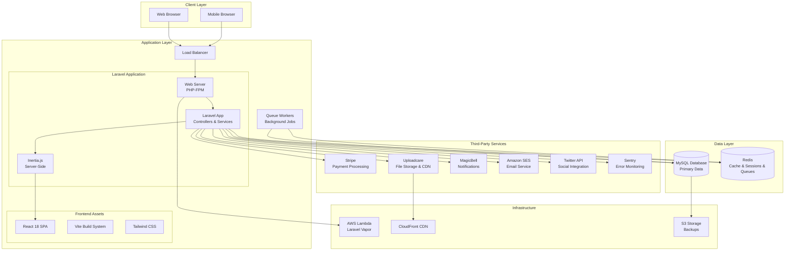

# Spenny Piggy - Technology Stack & Architecture Overview

## Executive Summary

Spenny Piggy is a modern, full-stack application built with Laravel 10 and React 18, serving as a platform for creators to receive gifts and tips from their fans. The architecture leverages cutting-edge technologies for high performance, scalability, and exceptional user experience.

## Technology Stack

### Backend Framework & Language
- **Laravel Framework**: 10.x (Latest LTS)
- **PHP Version**: 8.1+ (Modern PHP with performance optimizations)
- **Architecture Pattern**: MVC (Model-View-Controller) with Repository pattern

### Database & Caching
- **Primary Database**: MySQL 8.0+
  - ACID compliance for financial transactions
  - Optimized for read-heavy workloads
  - Full-text search capabilities
- **Redis**: In-memory data structure store
  - Session management
  - Queue backend
  - Caching layer
  - Real-time data storage

### Frontend Technologies
- **JavaScript Framework**: React 18
  - Concurrent features for improved performance
  - Automatic batching and Suspense
  - Server-side rendering capabilities
- **Inertia.js**: Modern monolith approach
  - SPA-like experience without API complexity
  - Server-driven client-side routing
  - Seamless Laravel-React integration
- **Build Tool**: Vite 6.2.4
  - Lightning-fast hot module replacement
  - Optimized production builds
  - Modern ES modules support
- **CSS Framework**: Tailwind CSS 3.2+
  - Utility-first approach
  - Responsive design system
  - Custom design tokens

### Development & Deployment Tools
- **Package Manager**: 
  - Composer (PHP dependencies)
  - NPM (JavaScript dependencies)
- **Asset Compilation**: Laravel Vite Plugin
- **Version Control**: Git
- **Hosting**: Laravel Vapor (AWS Lambda)

## Third-Party Services & APIs

### Payment Processing
- **Stripe**: Primary payment processor
  - Supports global payments
  - PCI DSS Level 1 compliance
  - Advanced fraud detection
  - Marketplace functionality for creator payouts

### File Storage & Management
- **Uploadcare**: Cloud-based file handling
  - Image and video processing
  - CDN delivery
  - Real-time image transformations
  - Secure file uploads with virus scanning

### Communication Services
- **MagicBell**: Real-time notifications
  - Multi-channel delivery (in-app, email, push)
  - User preference management
  - Analytics and engagement tracking
- **Email Service**: Amazon SES (Simple Email Service)
  - High deliverability rates
  - Bounce and complaint handling
  - Email template management

### Social & Content
- **Twitter API v2**: Social media integration
  - Auto-posting capabilities
  - Profile synchronization
  - Social proof features

### Security & Compliance
- **Laravel Sanctum**: API authentication
- **Google 2FA**: Two-factor authentication
- **Sentry**: Error tracking and performance monitoring
- **SumSub**: KYC/AML verification

## Architecture Components

### Core Application Services

#### 1. Web Application Layer
```
┌─────────────────────────────────────────────┐
│                 React SPA                   │
│  ┌─────────────┐ ┌─────────────┐ ┌─────────┐│
│  │  Components │ │    Pages    │ │  Hooks  ││
│  └─────────────┘ └─────────────┘ └─────────┘│
│  ┌─────────────────────────────────────────┐ │
│  │           Inertia.js Router            │ │
│  └─────────────────────────────────────────┘ │
└─────────────────────────────────────────────┘
```

#### 2. Backend Services Layer
```
┌─────────────────────────────────────────────┐
│              Laravel Backend                │
│  ┌─────────┐ ┌─────────┐ ┌─────────────────┐│
│  │   API   │ │   Web   │ │   Controllers   ││
│  │ Routes  │ │ Routes  │ │   & Services    ││
│  └─────────┘ └─────────┘ └─────────────────┘│
│  ┌─────────────────────────────────────────┐ │
│  │            Middleware Stack            │ │
│  └─────────────────────────────────────────┘ │
└─────────────────────────────────────────────┘
```

#### 3. Data Persistence Layer
```
┌─────────────────────────────────────────────┐
│               Data Layer                    │
│  ┌─────────┐ ┌─────────┐ ┌─────────────────┐│
│  │  MySQL  │ │  Redis  │ │   File Storage  ││
│  │Database │ │ Cache   │ │   (Uploadcare)  ││
│  └─────────┘ └─────────┘ └─────────────────┘│
└─────────────────────────────────────────────┘
```

### Background Processing System

#### Job Queue Architecture
The application utilizes Laravel's robust queue system for asynchronous processing:

**Queue Drivers Supported:**
- Redis (Primary - for production)
- Database (Fallback)
- Amazon SQS (Cloud-native option)

**Job Categories:**
1. **Email Processing Jobs**
   - Welcome emails
   - Payment confirmations
   - Notification emails
   - Newsletter subscriptions

2. **Payment Processing Jobs**
   - Stripe webhook handling
   - Payout processing
   - Subscription management
   - Refund processing

3. **Content Processing Jobs**
   - Image/video processing
   - Adult content detection
   - Social media posting
   - Analytics data processing

4. **Notification Jobs**
   - Push notifications
   - In-app notifications
   - Email notifications
   - SMS alerts

### Complete System Architecture Diagram



## Key Architectural Patterns

### 1. Monolith with SPA Frontend
- **Inertia.js Bridge**: Eliminates the need for separate API endpoints
- **Shared Routing**: Server-side routing with client-side navigation
- **Data Flow**: Direct props passing from Laravel controllers to React components

### 2. Event-Driven Architecture
- **Laravel Events**: Domain events for business logic
- **Queue Jobs**: Asynchronous processing for heavy operations
- **Webhook Handlers**: Real-time integration with external services

### 3. Service Layer Pattern
- **Service Classes**: Business logic abstraction
- **Repository Pattern**: Data access layer abstraction
- **Dependency Injection**: Laravel's service container

### 4. Microservice Integration
- **Third-party APIs**: Integrated as external services
- **Webhook Endpoints**: Real-time data synchronization
- **Circuit Breaker Pattern**: Fault tolerance for external services

## Security Architecture

### Authentication & Authorization
- **Laravel Sanctum**: SPA authentication
- **Role-Based Access Control**: User permissions system
- **Two-Factor Authentication**: Google 2FA integration

### Data Protection
- **Encryption**: Laravel's built-in encryption for sensitive data
- **HTTPS Everywhere**: SSL/TLS for all communications
- **Input Validation**: Form requests and validation rules
- **CSRF Protection**: Laravel's CSRF middleware

### Payment Security
- **PCI DSS Compliance**: Through Stripe integration
- **Webhook Validation**: Cryptographic signature verification
- **Secure Payment Flow**: No card data touches our servers

## Performance Optimizations

### Caching Strategy
1. **Application Cache**: Redis-based caching for database queries
2. **Session Storage**: Redis for fast session management
3. **CDN Caching**: Static assets via Uploadcare CDN
4. **OPCache**: PHP bytecode caching

### Database Optimization
- **Query Optimization**: Eloquent query optimization
- **Database Indexing**: Strategic index placement
- **Connection Pooling**: Efficient database connections

### Frontend Performance
- **Code Splitting**: Dynamic imports for components
- **Asset Optimization**: Vite's production optimizations
- **Lazy Loading**: React lazy loading for routes
- **Bundle Analysis**: Optimized JavaScript bundles

## Scalability Considerations

### Horizontal Scaling
- **Stateless Application**: Session data in Redis
- **Load Balancing**: Multiple application instances
- **Queue Workers**: Scalable background processing

### Vertical Scaling
- **Resource Optimization**: Efficient memory and CPU usage
- **Database Performance**: Query optimization and indexing
- **Caching Layers**: Multiple levels of caching

## Monitoring & Observability

### Application Monitoring
- **Sentry Integration**: Real-time error tracking
- **Laravel Telescope**: Development debugging
- **Custom Metrics**: Business KPIs tracking

### Infrastructure Monitoring
- **AWS CloudWatch**: Infrastructure metrics
- **Database Monitoring**: Query performance tracking
- **Queue Monitoring**: Job processing statistics

## Development Workflow

### Local Development
```bash
# Backend
php artisan serve
php artisan queue:work

# Frontend
npm run dev

# Testing
php artisan test
```

### Deployment Pipeline
1. **Version Control**: Git-based workflow
2. **Automated Testing**: PHPUnit and Jest
3. **Build Process**: Automated asset compilation
4. **Deployment**: Laravel Vapor deployment

## Future Architecture Considerations

### Potential Enhancements
1. **Microservices Migration**: Gradual service extraction
2. **GraphQL API**: Enhanced data fetching
3. **Real-time Features**: WebSocket integration
4. **AI/ML Integration**: Content recommendation engine
5. **Multi-region Deployment**: Global CDN and database replication

This architecture provides a solid foundation for a scalable, maintainable, and high-performance creator economy platform while maintaining development velocity and code quality.
